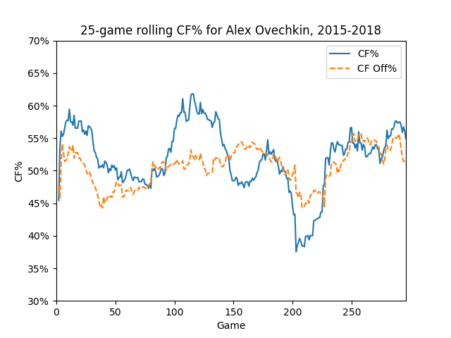

.. image:: https://travis-ci.org/muneebalam/scrapenhl2.svg?branch=master
    :target: https://travis-ci.org/muneebalam/scrapenhl2
.. image:: https://coveralls.io/repos/github/muneebalam/scrapenhl2/badge.svg?branch=master
    :target: https://coveralls.io/github/muneebalam/scrapenhl2?branch=master
.. image:: https://landscape.io/github/muneebalam/scrapenhl2/master/landscape.svg?style=flat
   :target: https://landscape.io/github/muneebalam/scrapenhl2/master
   :alt: Code Health
.. image:: https://badge.fury.io/py/scrapenhl2.svg
   :target: https://badge.fury.io/py/scrapenhl2
.. image:: https://api.codeclimate.com/v1/badges/63e04a03b3aab131e262/maintainability
   :target: https://codeclimate.com/github/muneebalam/scrapenhl2/maintainability
   :alt: Maintainability
.. image:: https://readthedocs.org/projects/scrapenhl2/badge/?version=latest
   :target: https://readthedocs.org/projects/scrapenhl2/?badge=latest
   :alt: Documentation Status

.. inclusion-marker-for-sphinx

Introduction
------------

scrapenhl2 is a python package for scraping and manipulating NHL data pulled from the NHL website.

Installation
-------------
You need python3 and the python scientific stack (e.g. numpy, matplotlib, pandas, etc).
Easiest way is to simply use `Anaconda <https://conda.io/docs/user-guide/install/index.html>`_.
To be safe, make sure you have python 3.5+, matplotlib 2.0+, and pandas 0.20+.

Next, if you are on Windows, you need to get python-Levenshtein.
`You can find it here <http://www.lfd.uci.edu/~gohlke/pythonlibs/#python-levenshtein>`_. Download the appropriate .whl
file--connect your version of python with the "cp" you see and use the one with "amd64" if you have an AMD
64-bit processor--and navigate to your downloads folder in command line. For example::

    cd
    cd muneebalam
    cd Downloads

Next, install the whl file using pip::

    pip install [insert filename here].whl

Now, all users can open up terminal or command line and enter::

    pip install scrapenhl2

(If you have multiple versions of python installed, you may need to alter that command slightly.)

For now, installation should be pretty quick, but in the future it may take awhile
(depending on how many past years' files I make part of the package).

As far as coding environments go, I recommend jupyter notebook or
`Pycharm Community <https://www.jetbrains.com/pycharm/download/#section=mac>`_.
Some folks also like the PyDev plugin in Eclipse. The latter two are full-scale applications, while the former
launches in your browser. Open up terminal or command line and run::

    jupyter notebook

Then navigate to your coding folder, start a new Python file, and you're good to go.

Use
---

*Note that because this is in pre-alpha/alpha, syntax and use may be buggy and subject to change.*

On startup, when you have an internet connection and some games have gone final since you last used the package,
open up your python environment and update::

    from scrapenhl2.scrape import autoupdate
    autoupdate.autoupdate()

Autoupdate should update you regularly on its progress; be patient.

To get a game H2H, use::

    from scrapenhl2.plot import game_h2h
    season = 2016
    game = 30136
    game_h2h.game_h2h(season, game)

.. image:: _static/WSH-TOR_G6.png

To get a game timeline, use::

    from scrapenhl2.plot import game_timeline
    season = 2016
    game = 30136
    game_timeline.game_timeline(season, game)

.. image:: _static/WSH-TOR_G6_timeline.png

To get a player rolling CF% graph, use::

    from scrapenhl2.plot import rolling_cf_gf
    player = 'Ovechkin'
    rolling_games = 25
    start_year = 2015
    end_year = 2017
    rolling_cf_gf.rolling_player_cf(player, rolling_games, start_year, end_year)

This package is targeted for script use, so I recommend familiarizing yourself with python.
(This is not intended to be a replacement for a site like Corsica.)

Look through the documentation at `Read the Docs <http://scrapenhl2.readthedocs.io/en/latest/>`_ and the
`examples on Github <https://github.com/muneebalam/scrapenhl2/tree/master/examples>`_.
Also always feel free to contact me with questions or suggestions.

Contact
--------
`Twitter
<http://www.twitter.com/muneebalamcu>`_.

Collaboration
-------------

I'm happy to partner with you in development efforts--just shoot me a message or submit a pull request.
Please also let me know if you'd like to alpha- or beta-test my code.

Donations
---------
If you would like to support my work, please donate money to a charity of your choice. Many large charities do
great work all around the world (e.g. Médecins Sans Frontières),
but don't forget that your support is often more critical for local/small charities.
Also consider that small regular donations are sometimes better than one large donation.

You can vet a charity you're targeting using a `charity rating website <https://www.charitynavigator.org/>`_.

If you do make a donation, make me happy `and leave a record here <https://goo.gl/forms/tl1jVm0D7esLLbfm1>`_..
(It's anonymous.)

Change log
----------

11/10/17: Switched from Flask to Dash, bug fixes.

11/5/17: Bug fixes and method to add on-ice players to file. More refactoring.

10/28/17: Major refactoring. Docs up and running.

10/21/17: Added basic front end. Committed early versions of 2017 logs.

10/16/17: Added initial versions of game timelines, player rolling corsi, and game H2H graphs.

10/10/17: Bug fixes on scraping and team logs. Started methods to aggregate 5v5 game-by-game data for players.

10/7/17: Committed code to scrape 2010 onward and create team logs; still bugs to fix.

9/24/17: Committed minimal structure.

Major outstanding to-dos
------------------------

* Bring in old play by play and shifts from HTML