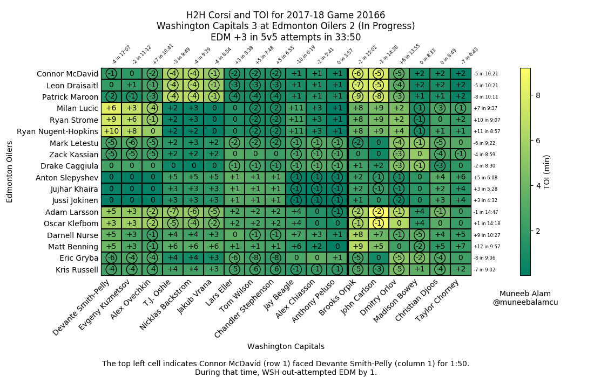
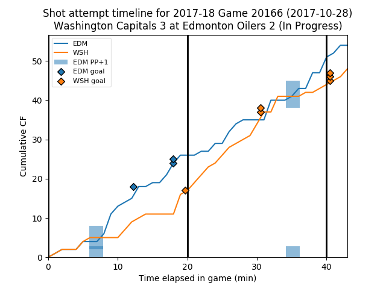
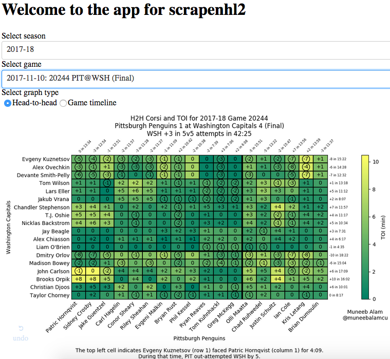
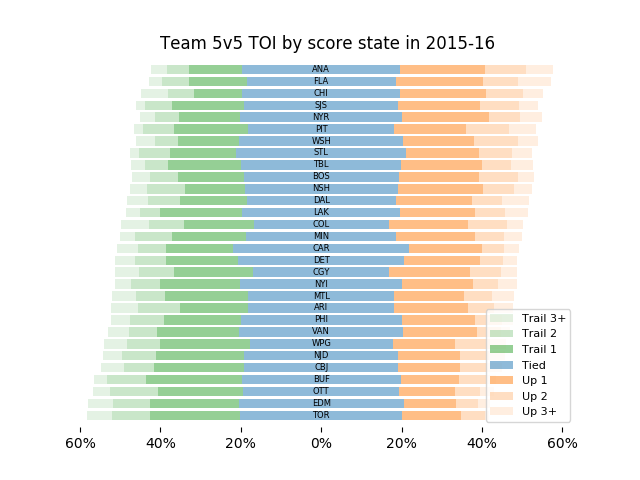
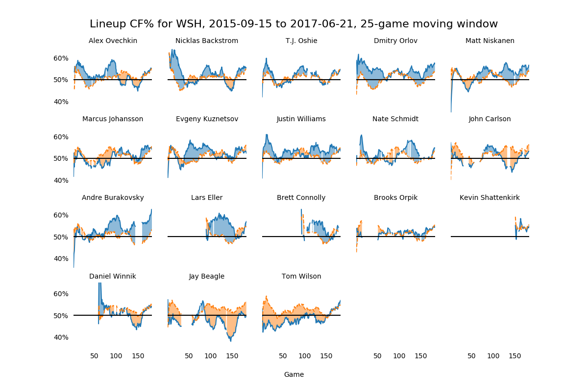
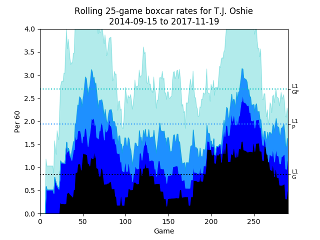

.. _plot:

Plot
====

The scrapenhl2.plot module contains methods useful for plotting.

Useful examples
----------------

First, import::

   from scrapenhl2.plot import *

Get the H2H for an in-progress game::

   live_h2h('WSH', 'EDM')

Get the Corsi timeline as well, but don't update data this time::

   live_timeline('WSH', 'EDM', update=False)

Save the timeline of a memorable game to file::

   game_timeline(2016, 30136, save_file='/Users/muneebalam/Desktop/WSH_TOR_G6.png')

More methods being added regularly.

App
----

This package contains a lightweight app for browsing charts and doing some data manipulations.

Launch using::

   import scrapenhl2.plot.app as app
   app.browse_game_charts()
   # app.browse_player_charts()
   # app.browse_team_charts()

It will print a link in your terminal--follow it. The page looks something like this:

The dropdowns also allow you to search--just start typing.

Methods (games)
-----------------

Game H2H
~~~~~~~~~~~
.. image:: _static/WSH-TOR_G6.png
   :width: 400 px
   :align: right

.. automodule:: scrapenhl2.plot.game_h2h
   :members:

Corsi timeline
~~~~~~~~~~~~~~~
.. image:: _static/WSH-TOR_G6_timeline.png
   :width: 400 px
   :align: right

.. automodule:: scrapenhl2.plot.game_timeline
   :members:

Methods (teams)
----------------

Team TOI by score state
~~~~~~~~~~~~~~~~~~~~~~~~

.. automodule:: scrapenhl2.plot.team_score_state_toi
   :members:

Team lineup CF%
~~~~~~~~~~~~~~~~

.. automodule:: scrapenhl2.plot.team_lineup_cf
   :members:

Methods (individuals)
----------------------

Player rolling CF and GF
~~~~~~~~~~~~~~~~~~~~~~~~~
.. image:: _static/Ovechkin_rolling_cf.png
   :width: 400 px
   :align: right

.. automodule:: scrapenhl2.plot.rolling_cf_gf
   :members:

Player rolling boxcars
~~~~~~~~~~~~~~~~~~~~~~

.. automodule:: scrapenhl2.plot.rolling_boxcars
   :members:

Methods (individual comparisons)
---------------------------------

Usage
~~~~~~
.. automodule:: scrapenhl2.plot.usage
   :members:

Helper methods
---------------

.. automodule:: scrapenhl2.plot.visualization_helper
   :members:

.. automodule:: scrapenhl2.plot.label_lines
   :members:

